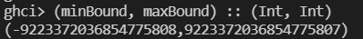
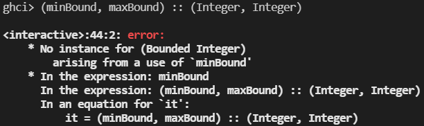

# PFL_TP1_GX_NN

## Configuração e/ou Instalção

README que deverá ainda incluir os passos necessário para configurar e/ou instalar as componentes necessárias (em Windows e Linux).

### Windows

> Aqui

### Linux 

> Aqui

---

## Explicação de funções

Por cada ficheiro de código-fonte é apresentado, por função, uma explicação sucinta do seu funcionamento e uma descrição de vários casos de teste.

Em específico, para as funções da alínea 2 também são exploradas as estratégias utilizadas na sua implementação.

 

### Fib.hs

 

### BigNumber.hs

#### `zip0`
**Funcionamento:** Os elementos de duas listas são emparelhados, formando pares, e quando uma delas termina a outra continua a ser emparelhada com o *Int* 0 até não ter mais elementos.

**Casos de teste:**
- Emparelhamento de listas vazias: 
- Emparelhamento de listas de igual tamanho:
- Emparelhamento de listas de diferente tamanho:  

#### `cleanLeft0s`
**Funcionamento:** Dada uma lista de *Int*, são eliminados da mesma os primeiros elementos que forem o *Int* 0. É assegurado que fica pelo menos um elemento na lista devido à concatenação do *last l*, ou seja, o último elemento da lista permanece idependentemente do seu valor.

**Casos de teste:**

#### `bnList`
**Funcionamento:** Converte um BigNumber para uma lista de inteiros, ignorando assim o sinal do número.

**Casos de teste:**

#### `stringToN`
**Funcionamento:** Percorre a lista de *Char* e cria uma lista de *Int* aplicando a função *digitToInt* do módulo *Data.Char*.

**Casos de teste:**

#### `scanner`
**Funcionamento:** Inicializa o *BigNumber* tirando partido da lista de *Int* gerada pela função *stringToN* referida anteriormente e limpando os dígitos não significantes pela aplicação da função *cleanLeft0s*. Tem em conta o primeiro caracter da *String* de forma a inicializar o *BigNumber* como positivo (*Positive*) ou negativo (*Negative*).

**Estratégia:**

**Casos de teste:**

#### `nToString`
**Funcionamento:**

**Casos de teste:**

#### `output`
**Funcionamento:**

**Estratégia:**

**Casos de teste:**

#### `sumDigits`
**Funcionamento:**

**Casos de teste:**

#### `somaBN`
**Funcionamento:**

**Estratégia:**

**Casos de teste:**

#### `subDigits`
**Funcionamento:**

**Casos de teste:**

#### `subBN`
**Funcionamento:**

**Estratégia:**

**Casos de teste:**

#### `mulDigit`
**Funcionamento:**

**Casos de teste:**

#### `mulParcelas`
**Funcionamento:**

**Casos de teste:**

#### `mulNs`
**Funcionamento:**

**Casos de teste:**

#### `mulBN`
**Funcionamento:** Aplica as propriedades da multiplicação no que toca aos sinais, fazendo corresponder o sinal correto à multiplicação obtida que foi gerada independentemente dos sinais dos argumetos.

**Estratégia:**

**Casos de teste:**

#### `sucBN`
**Funcionamento:** Produz uma lista infinita de *BigNumber*, cujo primeiro elemento é o argumento *i* e os seguintes são o resultado de, recursivamente, somar 1 unidade ao elemento anterior na lista.

**Casos de teste:**

#### `divBN`
**Funcionamento:** Começa por produzir uma lista de pares *(q, dq)* em que *dq* corresponde a múltiplos do divisor e *q* correesponde ao multiplicador que dá origem a *dq* (ou seja, *divisor \* q = dq*). Desta lista infinita de pares ordenada, vai se buscar só os elementos cujo *dq* é menor que o *dividendo* da divisão. Daí retira-se o *q* e o *dq* do último elemento da lista que correspondem, respetivamente, ao *quociente* e ao valor pelo qual a subtração do *dividendo* por ele resulta no *resto*.

**Estratégia:**

**Casos de teste:**

#### `safeDivBN`
**Funcionamento:**

**Estratégia:**

**Casos de teste:**

---

## Resposta à alínea 4

> Comparação das resoluções das alíneas 1 e 3 com tipos (Int -> Int), (Integer -> Integer) e (BigNumber -> BigNumber), explorando a sua aplicação a números grandes e verificando qual o maior número que cada uma aceita como argumento.

### (Int -> Int)

O tipo *Int* permite representar inteiros de 64 bits, pelo que o maior número possível de ser representado corresponde a *2^63 - 1 = 9 223 372 036 854 775 807*. Tal informação foi também verificada pelo recurso à função **maxBound**: 

Testando assim uma versão das alíneas da pergunta 1, mas restringindo o tipo ao pretendido, obtivemos os seguintes resultados: 
   
| Argumento (n)| Resultado Esperado | Resultado Obtido
| :--: | --: | --: |
| 90 | 2 880 067 194 370 816 120 | 2 880 067 194 370 816 120 |
| 91 | 4 660 046 610 375 530 309 | 4 660 046 610 375 530 309 |
| 92 | 7 540 113 804 746 346 429 | 7 540 113 804 746 346 429 |
| 93 | 12 200 160 415 121 876 738 | -6 246 583 658 587 674 878 |
   
Concluimos, que o maior número que aceita como argumento é 92, último cujo valor na sequencia é menor ao limite de *INT*.

### (Integer -> Integer)

O tipo *Integer* é um tipo de precisão arbitrária, isto significa que consegue representar qualquer número independentemente do seu tamanho, dentro do limite da memória do computador. O limite de representação é assim tão maior quanto a memória que existe disponível. O que traduz na inexistência de *overflows*, no entanto, as operações aritméticas tornam-se relativamente lentas.

(falta teste + maior argumento que aceita)

### (BigNumber -> BigNumber)

O tipo *BigNumber* é representado como uma lista de digitos. Por isso, não existe um limite de representação tão rigido como explorado nos pontos acima. Este assim é o tipo ideal a usar quando pretendemos trabalhar com números relativamente grandes. Provavelmente, traduzirá computações mais pessadas devido a operações internas, mas é superior a nível da representação dos números.

(falta teste + maior argumento que aceita)

---

*NOTA*: Os testes apresentados foram realizados principalmente com recurso às função do tipo lista, de forma a contornar a complexidade inerente à  função fibRec que é de ordem exponencial.
